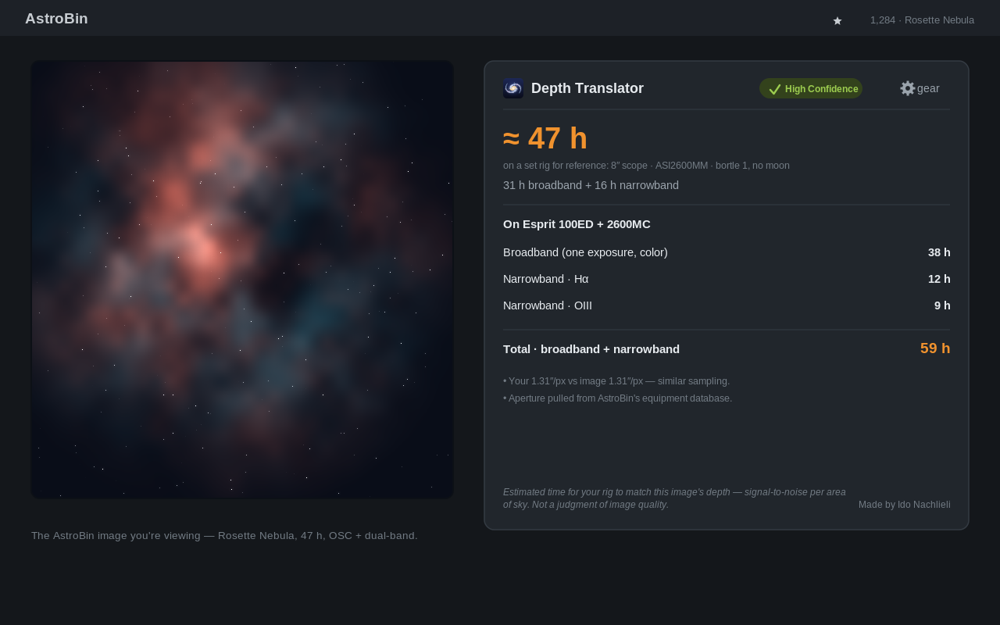

# AstroBin Depth Translator

**A Chrome extension that tells you how deep an AstroBin image's data really is — and how long *your* gear and sky would need to match it.**

Raw integration time can't be compared across setups: a 4-hour image on a 24" scope under dark skies holds far more signal than 4 hours on a small refractor in the city. This extension reads any AstroBin image page and reports the depth in two honest, comparable numbers — equivalent hours on a fixed **reference rig** (so any two images line up at a glance), and equivalent hours on **your own rig**, split by broadband and each narrowband line.



## Install

**[→ Chrome Web Store](#)** *(link will go here once the store review completes)*

Or load it unpacked:

1. Open `chrome://extensions` and enable **Developer mode**.
2. **Load unpacked** → select the `astrobin-depth-translator` folder.
3. Open any image at `app.astrobin.com/i/…`. A default rig is pre-loaded so it works immediately; click **⚙ gear** to set your own.

## How it works (and why you can trust the number)

The metric is **depth per unit area of sky** — signal-to-noise for a fixed patch of sky — which depends on aperture, throughput (QE × filter transmission), and sky brightness, but *not* on pixel scale or focal length. That's deliberate: f-ratio is a per-pixel speed effect, and this metric is resolution-independent so two images of the same target are judged on the signal they actually captured.

The translator then rescales to your rig:

```
your time = image time × (their aperture ÷ your aperture)²
                       × (their QE·transmission ÷ yours)
                       × (your sky flux ÷ their sky flux)
```

Hover any number in the panel to see this formula with the real values substituted. The full derivation is in [`docs/AstroBin_Depth_Translator_Technical_Documentation.pdf`](docs/AstroBin_Depth_Translator_Technical_Documentation.pdf), and the entire calculation is open in [`astrobin-depth-translator/src/engine.js`](astrobin-depth-translator/src/engine.js) — don't trust the number, read the math.

Image data (integration, equipment, sky, pixel scale) is read from the page; telescope aperture, filter bandwidth, and sensor specs are pulled from **AstroBin's own public equipment API** and cached locally. A small built-in table fills the gaps AstroBin doesn't publish (sensor QE, filter transmission). A confidence badge flags which inputs are known versus estimated.

Depth is about *signal*. For *detail*, there's also a **"Match this image at 100%"** per-pixel planner: adjust a hypothetical scope's focal length, aperture, or f-ratio and it tells you whether you'd reproduce the image's resolution at 1:1 on your sensor — and the integration time to get there.

## Privacy

Everything runs in your browser, and **nothing is sent anywhere by default**. There's an optional, off-by-default toggle to share anonymous usage data (a random install id, which gear/settings were used, and errors — no name, no account). See [`astrobin-depth-translator/PRIVACY.md`](astrobin-depth-translator/PRIVACY.md).

## Repository layout

```
astrobin-depth-translator/   The extension (this is what ships)
  src/                       Depth + translator math, page parser, panel UI
  manifest.json, icons/      MV3 manifest and icons
  README.md, PRIVACY.md      Extension docs + privacy policy
  STORE_LISTING.md           Chrome Web Store copy

astrobin-analytics/          Optional, self-hostable backend for the opt-in
                             usage data (free Cloudflare Worker + D1). Off
                             unless you deploy it; see its SETUP.md.

store-assets/                Screenshots and promo images
docs/                        Design spec and technical documentation
```

## License

MIT — see [`astrobin-depth-translator/LICENSE`](astrobin-depth-translator/LICENSE). Built by [@idonachlieli](https://github.com/idonachlieli).
